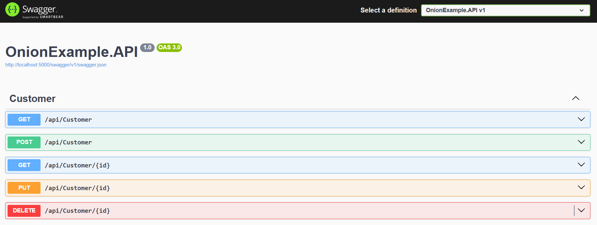

OnionExample (.NET 8, Onion Architecture)
Minimal solution with Onion Architecture:
- Domain: Entities and contracts.
- Application: Services / use case orchestration.
- Infrastructure: Implementations (repositories, here in-memory).
- API: ASP.NET Core Web API.

## Structure
```
src/
  OnionExample.Domain/
    Entities/
      Customer.cs
      Order.cs
    Interfaces/
      ICustomerRepository.cs
  OnionExample.Application/
    Services/
      CustomerService.cs
  OnionExample.Infrastructure/
    Repositories/
      CustomerRepository.cs
  OnionExample.API/
    Controllers/
      CustomerController.cs
    Program.cs
```

## Requirements
- .NET SDK 8.0

## Restore, Build, and Run
```powershell
# Windows PowerShell from the root of the repo
# 1) (Optional) Create the solution and add projects if the .sln does not exist
if (-not (Test-Path "OnionExample.sln")) {
  dotnet new sln -n OnionExample
  dotnet sln add src/OnionExample.Domain/OnionExample.Domain.csproj
  dotnet sln add src/OnionExample.Application/OnionExample.Application.csproj
  dotnet sln add src/OnionExample.Infrastructure/OnionExample.Infrastructure.csproj
  dotnet sln add src/OnionExample.API/OnionExample.API.csproj
}

# 2) Restore and build
dotnet restore
dotnet build -c Release

# 3) Run the API (Swagger enabled in Development)
dotnet run --project src/OnionExample.API/OnionExample.API.csproj
```

Swagger in development: https://localhost:5001/swagger (port may vary depending on Kestrel / HTTPS dev cert).

## Basic Endpoints
- GET `api/customer`
- GET `api/customer/{id}`
- POST `api/customer`
- PUT `api/customer/{id}`
- DELETE `api/customer/{id}`

Example POST (via Swagger or curl):```json
{
  "firstName": "Ada",
  "lastName": "Lovelace",
  "email": "ada@example.com"
}

```
Notes

- In-memory repository (data is lost when the app restarts).
- Order is included as a second basic model to illustrate the domain; this minimal version does not expose order endpoints.
```


## Swagger API Overview




## Hands-on Lab: Onion Architecture

**No code!** Just run commands and see the architecture in action.

### 1) Start the API
```powershell
$env:ASPNETCORE_ENVIRONMENT="Development"
dotnet restore
dotnet build -c Release
dotnet run --project src/OnionExample.API/OnionExample.API.csproj
```

### 2) Open Swagger UI
Navigate to: `http://localhost:5000/swagger`

### 3) Test the API Flow
**Create a customer:**
- Click **POST** `/api/customer`
- Click **Try it out**
- Use this JSON:
```json
{
  "firstName": "Alan",
  "lastName": "Pacheco", 
  "email": "alan2938@gmail.com"
}
```
- Click **Execute**

**See the data:**
- Click **GET** `/api/customer` → **Try it out** → **Execute**
- Copy the `id` from the response
- Click **GET** `/api/customer/{id}` → paste the id → **Execute**

### 4) Explore the Architecture Layers
**Open these files to see the flow:**

1. **API Layer** (`src/OnionExample.API/Controllers/CustomerController.cs`)
   - See how controller receives `ICustomerService`
   - Notice: depends on interface, not concrete class

2. **Application Layer** (`src/OnionExample.Application/Services/CustomerService.cs`)
   - See how service implements `ICustomerService`
   - Notice: depends on `ICustomerRepository` interface

3. **Domain Layer** (`src/OnionExample.Domain/Interfaces/ICustomerRepository.cs`)
   - See the contract/interface definition
   - Notice: no implementation details

4. **Infrastructure Layer** (`src/OnionExample.Infrastructure/Repositories/CustomerRepository.cs`)
   - See the actual implementation
   - Notice: implements the interface from Domain

5. **Dependency Injection** (`src/OnionExample.API/Program.cs`)
   - See how interfaces are wired to implementations
   - Notice: `ICustomerService` → `CustomerService`

### 5) See the Dependency Flow
**The request flows like this:**
```
HTTP Request → CustomerController → ICustomerService → CustomerService → ICustomerRepository → CustomerRepository
```

**Key insight:** Each layer depends on interfaces (abstractions), not concrete classes!

### 6) Test Different Operations
- **Update:** PUT `/api/customer/{id}` with modified data
- **Delete:** DELETE `/api/customer/{id}`
- **List all:** GET `/api/customer`

### 7) What You Learned
✅ **Separation of Concerns:** Each layer has one responsibility  
✅ **Dependency Inversion:** High-level modules don't depend on low-level modules  
✅ **Interface Segregation:** Small, focused interfaces  
✅ **Testability:** Easy to mock interfaces for testing  
✅ **Flexibility:** Can swap implementations without changing other layers
